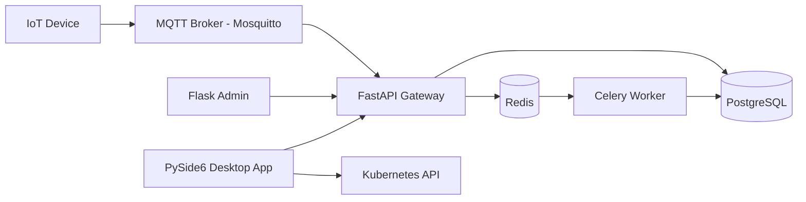
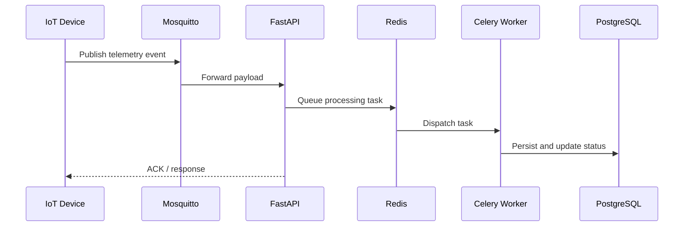
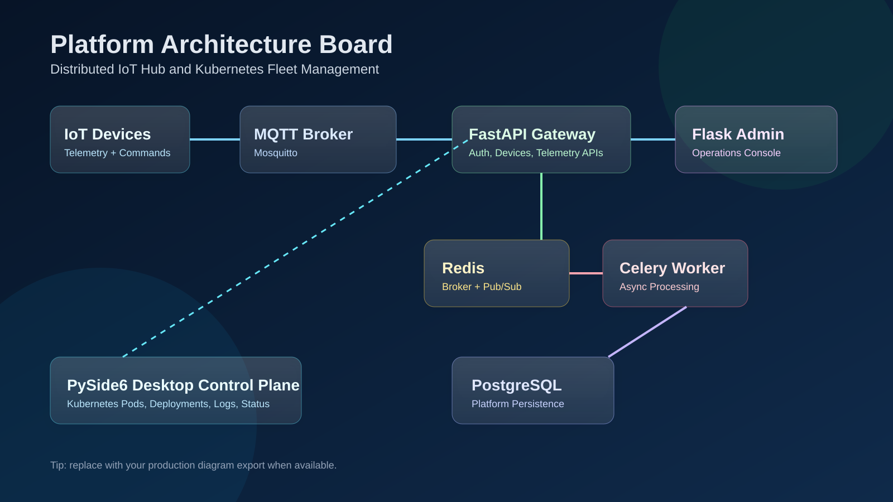
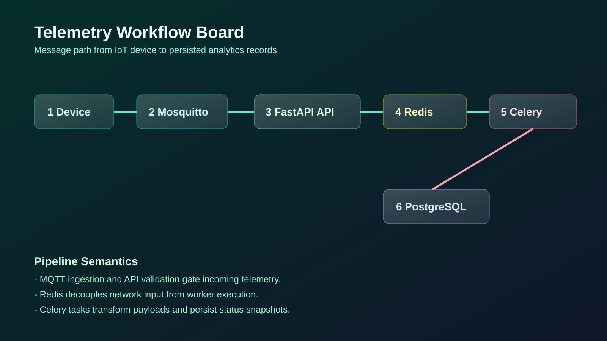
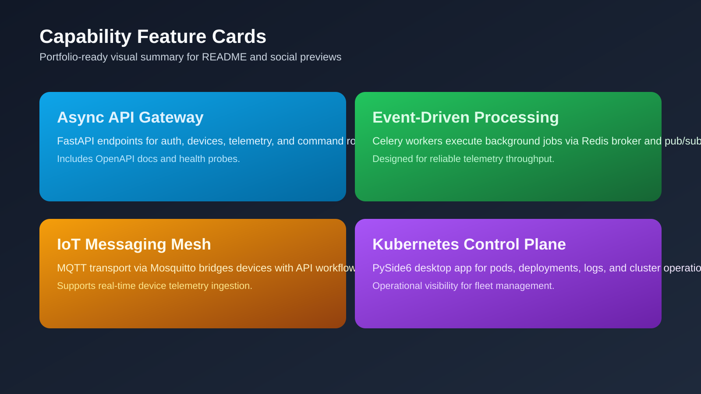
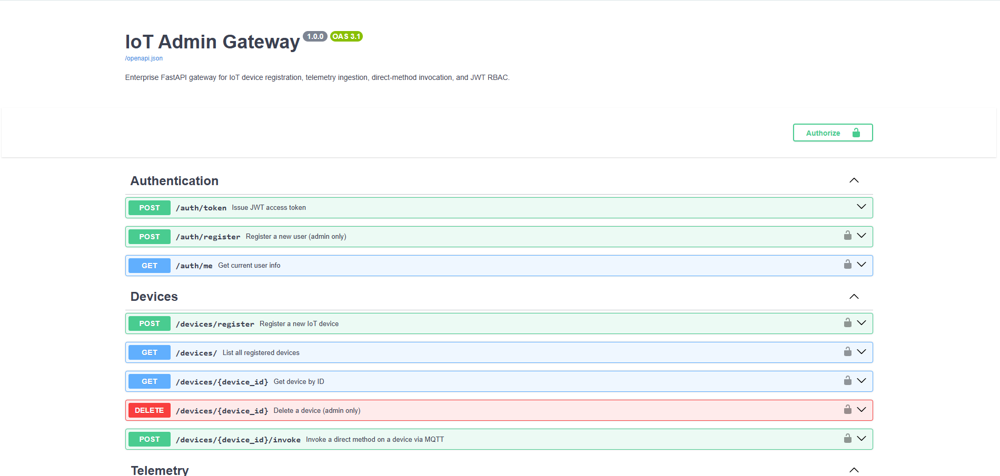
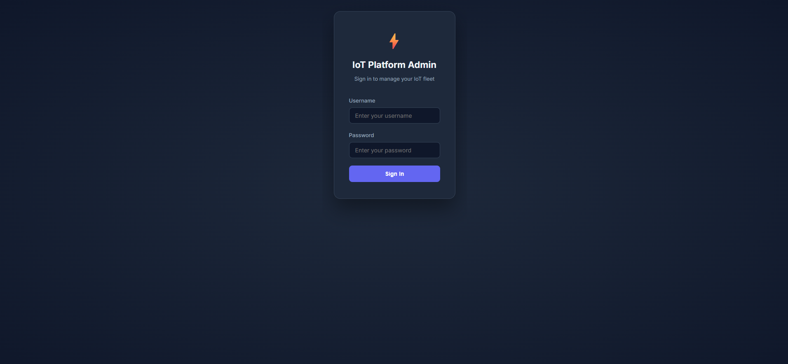
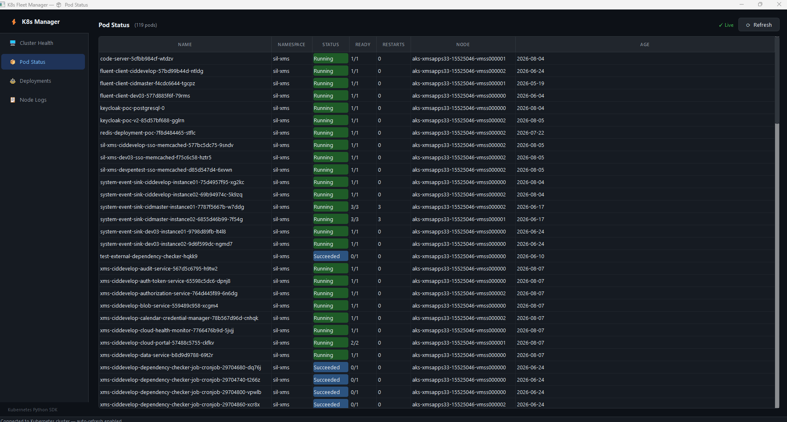
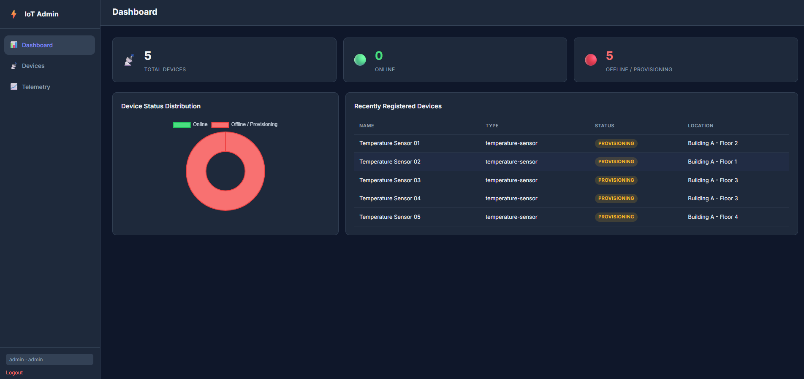

# Distributed IoT Hub and Kubernetes Fleet Management Platform

[](https://www.python.org/)
[](https://fastapi.tiangolo.com/)
[](https://flask.palletsprojects.com/)
[](https://docs.celeryq.dev/)
[](https://www.docker.com/)

Production-style Python platform for IoT telemetry, command orchestration, and Kubernetes operations visibility.
It combines async APIs, event-driven processing, MQTT transport, and a desktop control plane for real-time fleet operations.

## Project Highlights

- Async FastAPI gateway for authentication, devices, and telemetry workflows
- Celery worker pipeline with Redis pub/sub and broker-backed background processing
- MQTT-based telemetry transport using Eclipse Mosquitto
- Flask admin console for operational controls
- PySide6 desktop app for Kubernetes pods, deployments, logs, and cluster views
- Containerized local platform via Docker Compose

## Architecture



## Telemetry Workflow



## Visual Showcase

The docs/images folder now contains reusable visual assets for GitHub portfolio presentation.

### Architecture Board



### Workflow Board



### Feature Cards



### App Screenshot Placeholders






## Repository Layout

```text
.
├── infra/
│   ├── mosquitto/
│   └── postgres/
├── services/
│   ├── fastapi-gateway/
│   ├── flask-admin/
│   ├── celery-worker/
│   └── desktop-app/
├── docker-compose.yml
└── run.sh
```

## Technologies Used

- Language: Python 3.11+
- API and Web: FastAPI, Uvicorn, Flask
- Messaging and Async: MQTT (Paho), Celery, Redis
- Database: PostgreSQL, SQLAlchemy, Alembic
- Desktop: PySide6, Kubernetes Python Client
- Infrastructure: Docker, Docker Compose
- Security and Auth: JWT (`python-jose`), `passlib`

## Quick Start

### 1. Clone repository

```bash
git clone git@github.com:arpitsharmagit/k8s-management-python.git
cd k8s-management-python
```

### 2. Start full platform (Docker)

```bash
chmod +x run.sh
./run.sh stack
```

### 3. Access services

- FastAPI docs: http://localhost:8000/docs
- Flask admin: http://localhost:5000
- PostgreSQL: localhost:5432
- Redis: localhost:6379
- MQTT: localhost:1883

## Local Development Modes

```bash
./run.sh fastapi
./run.sh flask
./run.sh worker
./run.sh desktop
```
